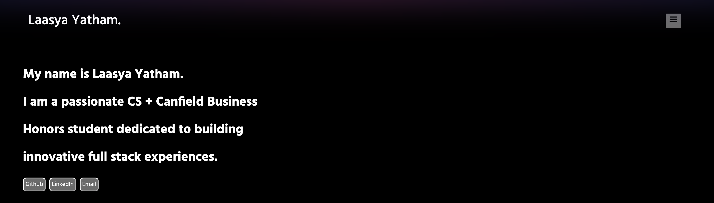
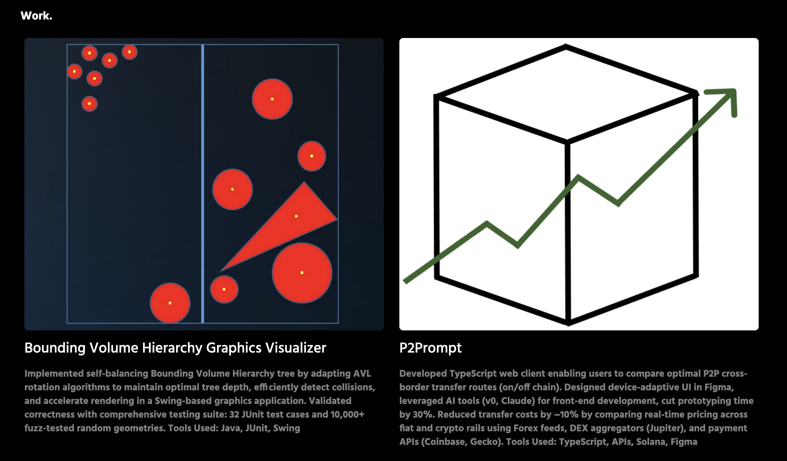
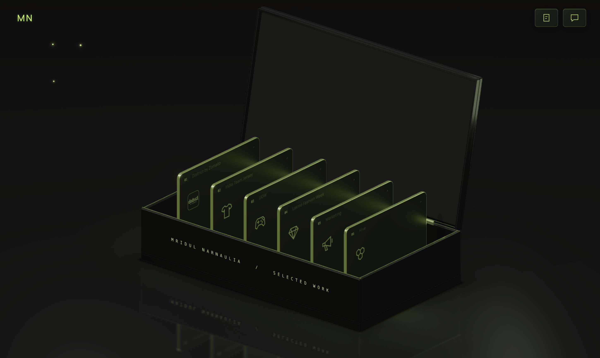

# Portfolio Structure — Laasya Yatham

## Existing UI

### Top Section of Home Page

### Project View

## Updates

1. Redesign home page. Follow a black and white minimalism theme

### Section 1 (Black bg, white text)

a. Left Side:
state Name, CS + Business Honors @ UT Austin in big text and save room for a brief outline of my interests + contact info (circular icons) Also put a in-line link to view the full professional summary (section 2). this text should be animated and rise up to the center of the home page from the bottom of the screen.

b. Right Side:
Put 4 categories (rectangles with a line between them). This should also follow the same animation style from the bottom of the screen. Full-Stack, Security, Fintech, Systems Projects. On category hover, the element should appear bigger.

Note: provide your category recommendation to include 3 full-stack (2 of which are fin tech), data structures (1-3), comp arch/os coursework (2), cloud project (1), and security projects (2).

I want categories to ideally have 3 projects per.

### Section 2 (White bg, black text)
Extended Professional Summary. Leave placeholder and generate design for this.

### Section 3 (Black bg, white text)
This is not a new section. When a project category is clicked, this is what the UI should look like. 

Create animation that moves name + major + project categories off the screen by sliding left. Slide project content from the right side of the screen. Include picture for the project, optional GitHub and Presentation Links, tech stack list, and few phrase blurb. All projects per section should be shown. Make the display space adaptive to content. A section will typically have 2-3 projects.

This is a nested view. Also create a projects tab in the main menu. It should show all projects organized in a mind map view and when a proejct is clicked, the right side of the screen should open a drawer with the project information.

### Section 4 (White bg, black text)
Here, list 4 buckets for the orgs I'm in. Under the bucket, give a quick comma seperated list of what each org entails

If the user howers over it, populate a grey section with org details. Put a placeholder for a picture on the left side, with description of the org + impact on the right.

1. Longhorn Developers
- SureWalk Mobile App
- TypeScript, JavaScript, React, Code Review, Drizzle, Samsara API

2. Tech Consulting Group
- Consulting Curriculum + Fellow Project
- Tableau, Excel, Data Analytics, Cloud Technologies

3. Texas Blockchain
- Hackathon Focused + Curriculum
- APIs, Agent Integrations, Solidity, Fintech

4. Computer Science & Business Association
- Director of Enterprise
- Professional Development (Mentoring sessions, Social Nights, etc)

### Ad Hoc
- Make suggestions for other useful portfolio items/sections
- Create a ui.md file with rules for styling/palette.
- Try out dynamic motion UIs, like how the portfolio below highlighted each product in the box.
#### Inspo

## Rules

1. Make all outlines NON curved.
2. Use professional fonts/languages
3. Avoid typical Claude UI styles. I want this to look unique.

